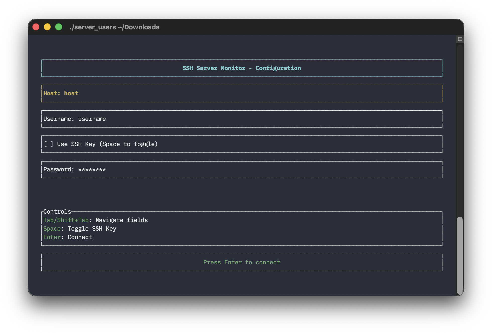

# Building server_users for Multiple Platforms

This document describes how to build release binaries for macOS ARM64 and Linux x86_64.



## Quick Start

### Using Make

```bash
# Build for macOS ARM64 (native)
make build-macos

# Build for Linux x86_64 (requires cross)
make build-linux

# Build for all platforms
make build-all

# Create release packages
make release
```

### Using Cargo Directly

#### macOS ARM64 (native on Apple Silicon)

```bash
rustup target add aarch64-apple-darwin
cargo build --release --target aarch64-apple-darwin
```

#### Linux x86_64 (cross-compilation from macOS)

```bash
# Install cross for easier cross-compilation
cargo install cross

# Build for Linux
cross build --release --target x86_64-unknown-linux-gnu
```

## Prerequisites

### For macOS builds

- Rust toolchain installed
- macOS development tools (Xcode Command Line Tools)
- OpenSSL: `brew install openssl@3`

### For Linux cross-compilation from macOS

- Install `cross`: `cargo install cross`
- Docker (cross uses Docker for cross-compilation)

### For native Linux builds

- Rust toolchain installed
- Development packages:

  ```bash
  sudo apt-get update
  sudo apt-get install -y libssh2-1-dev libssl-dev pkg-config
  ```

## GitHub Actions Automated Releases

The project includes a GitHub Actions workflow that automatically builds and releases binaries for both platforms when you push a version tag.

### Creating a Release

1. Update version in `Cargo.toml`
2. Commit changes
3. Create and push a tag:

   ```bash
   git tag v0.1.0
   git push origin v0.1.0
   ```

The workflow will automatically:

- Build binaries for macOS ARM64 and Linux x86_64
- Create compressed archives
- Create a GitHub release with attached binaries

## Output

Release binaries will be created in the `releases/` directory:

- `server_users-<version>-macos-arm64` (and `.tar.gz`)
- `server_users-<version>-linux-x86_64` (and `.tar.gz`)

## Troubleshooting

### OpenSSL linking issues on macOS

If you encounter OpenSSL linking errors:

```bash
brew install openssl@3
export OPENSSL_DIR=$(brew --prefix openssl@3)
```

### Cross-compilation issues

If `cross` fails, ensure Docker is running:

```bash
docker info
```

### Missing targets

Add required targets:

```bash
rustup target add aarch64-apple-darwin
rustup target add x86_64-unknown-linux-gnu
```
